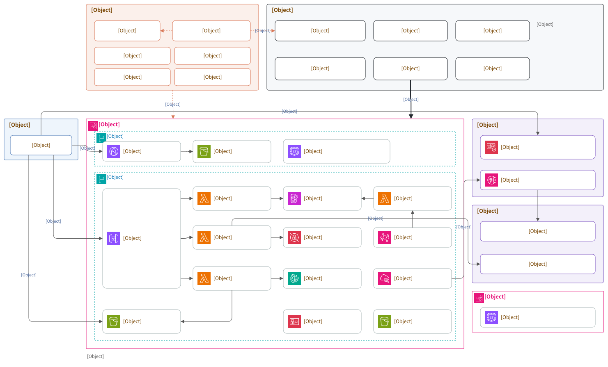

# sakekasu 家計簿 (kakeibo.sakekasu-builder.com)

クレジットカードと PayPay の明細を取り込んで、カテゴリごとの上限と突き合わせ、月末に叱ってくれる家計簿。手入力をなるべくしないことを最優先にしている。

困るのは明細に「どこで払ったか」しか書いていないこと。コンビニの 1,200 円がおにぎりとティッシュペーパーのまま食費に落ちる。そこでレシートの写真を主軸に置いた。撮ると品目と単価を読み取り、金額と日付で明細行に突き合わせ、品目ごとにカテゴリを付ける。

## 機能

ここに載っているものはすべて実装済み。これから作るものは [GitHub Issue](https://github.com/yuuuuuuu168/sakekasu-kakeibo/issues) で管理する。

### 取り込む

| 機能 | 補足 |
|------|------|
| CSV の取り込み | Shift_JIS と UTF-8 の両方。解析はブラウザの中だけで行い、確定した明細だけをサーバへ送る |
| 列の自動推定 | ヘッダ名と値の形から日付・店名・金額を当てる。金額の列が複数ある形式では「ご利用金額」を選ぶ。外したら画面で指定し直せて、指定はソースごとに覚える |
| ヘッダの無い CSV | 三井住友カードの古い形式など。値の形だけで列を当てる |
| 出金・入金が別列の形式 | PayPay など。入金は返金として負の金額で入る |
| PDF の取り込み | テキスト層から「日付 … 店名 … 金額」の行を起こす |
| 二重取り込みの防止 | 明細の ID を内容から決める。同じ CSV を 2 回落としても増えない。再取り込みで手作業の内訳も消えない |

### 分ける

| 機能 | 補足 |
|------|------|
| 店舗名の正規化 | 半角カナ・全角英数・店舗番号・Amazon の注文 ID を落として名寄せする |
| 自動分類 | 国内でよく出る店を 160 件ほど初期搭載。カテゴリを直すと「この店は今後もこれ」を覚える |
| 内訳待ち | コンビニ・ドラッグストア・スーパー・Amazon・居酒屋など、1 回の支払いに複数カテゴリが混ざる店に印を付ける。確定するまで画面に「この数字は甘い」と出続ける |
| レシート OCR | Bedrock（Claude Sonnet 4.6）が店名・日付・合計・品目を読む。品目のカテゴリはここでは品目名の表で仮に付けるだけ |
| カテゴリ判定 | 品目名と店舗名を TypeSafe の Jev に聞き、大カテゴリ → 小カテゴリの 2 段で決める。確信度で「そのまま入れる / 人に見せる / 未分類に落とす」を分け、人が直した品目は覚える。判定が落ちても品目名の表とルールで先へ進む |
| 大カテゴリと小カテゴリ | 2 段まで。上限と月次レポートは大カテゴリの単位で数える |
| 値引き・チャージ | レシートの値引きの行は「値引き」カテゴリに入れる。PayPay や Suica へのチャージは振替として支出から外し、外した額は別に出す |
| ドルのレシート | レシートのレートで円に直し、円の請求額から ±6% 以内の明細を候補にする |
| 重複の検知 | 現金で保存したレシートと後から取り込んだカード明細など、取り込み元の違う同じ支払いを拾う。片方を消すか、重複ではないと印を付ける |
| 明細との自動マッチ | 合計金額の一致を必須に、日付の近さと店名の近さでスコアを付ける。迷いの無い候補が 1 件だけなら自動で紐付け、それ以外は候補を並べる |
| ワンタップ分割 | レシートが無いとき用。1,200 円を 食費 800 / 日用品 400 に割る。均等割りもある |
| 明細の無い支払いの登録 | 対応する明細が無いレシートは、支払い方法（現金・PayPay・クレジットカード・Suica・不明）を選んでそのまま支出として登録できる。支払いの印字から読めた支払い方法が初期値になる |
| 保存済みレシートの見直し | 一覧の行を押すと開いて中身を確かめ、直せる。レシートから作った明細は日付・金額・支払い方法ごと、紐付けた明細は内訳だけが合わせて直る |

### 見る・叱られる

| 機能 | 補足 |
|------|------|
| カテゴリごとの上限 | 月単位。前月からコピーできる |
| ダッシュボード | 支出・月末の着地見込み・超過額・内訳待ちの件数。カテゴリ別は棒で出し、超えたら上限の位置で区切る |
| 明細一覧 | 月・カテゴリ・内訳待ちで絞る。カテゴリの付け替えと内訳の分割はここから |
| カテゴリの改名と統合 | 統合すると過去の明細の内訳も付け替わる。最初の数か月で作り直す前提 |
| 月末の叱りレポート | 毎月 1 日に前月分を作る。超過率で 5 段階（天晴れ / よし / むむ / 喝 / 激怒） |
| 店舗別の集計 | 「何に散財しているか」はカテゴリより店で見たほうが早いことがある |
| 定期支払い | サブスクなどを登録しておくと、着地見込みに入れ、取り込んだ明細と突き合わせる |
| 身に覚えの確かめ | レシートにも定期支払いにも突き合わないカード・PayPay の支払いを、月次レポートの「これ大丈夫？」に並べる |

### アカウント・基盤

| 機能 | 補足 |
|------|------|
| 共通ログイン | 4 アプリ共通の Cognito ユーザープールのマネージドログイン（`auth.sakekasu-builder.com`）へリダイレクトして入る（認可コード + PKCE）。セルフサインアップなし、MFA（認証アプリの TOTP）は必須 |
| データ保護 | DynamoDB の PITR、S3 の公開禁止と暗号化、4 つの主要リソースは `RemovalPolicy.RETAIN` |
| レシート画像の自動削除 | 90 日。OCR で品目を取り出した後の画像は残す意味が薄い |
| 配信 | S3 + CloudFront（OAC）。`kakeibo.sakekasu-builder.com` で配信し、セキュリティヘッダも CDK の中に置いた |
| ローカルモード | AWS が無くても `npm run dev` で通しで動く。データは localStorage |
| PR ごとのテスト・lint・型検査 | GitHub Actions がフロントとインフラの 2 系統を並べて走らせる |
| アラーム | Lambda・API・DynamoDB・月次レポートの失敗を、共通基盤の SNS 経由で Slack に送る |

### これから

| 機能 | 状態 |
|------|------|
| 画像として出力された PDF の取り込み | 未着手。いまはその場で断って CSV を促す。レシート OCR とは出力の形が違うので、経路を分けて作ることになる |
| 銀行・カード会社との自動連携 | やらない。明細の手動アップロードで始める |
| 収入と資産の管理 | やらない。支出だけを見る |
| 複数人での共有 | やらない。世帯の概念を入れない |

## こだわりポイント

### 「内訳待ち」という状態を作った

この家計簿の主題は、コンビニの 1,200 円をおにぎりとティッシュペーパーに割ることにある。だから「分類できた」と「何を買ったか分かった」を別の状態として持たせた。

初期搭載のルールには `ambiguous` の印が付いたものがある。コンビニ、ドラッグストア、スーパー、Amazon、ホームセンター、居酒屋。これに当たった明細はカテゴリが付いたうえで `needsDetail` が立ち、レシートを当てるか内訳を分割するまで印が残る。ダッシュボードにも月次レポートにも「内訳が未確定の明細が N 件ある。この数字は甘く出ている」と出続ける。

分類を当てただけで満足しないための仕掛けで、放置しても嘘の数字を信じずに済む。

### レシートと明細の突き合わせは、金額の一致を必須にした

候補に入る条件は合計金額の完全一致のみ。日付と店名はスコアにしか使わない。家計簿で一番信用できる手がかりは金額だから。

日付のずれは前後 4 日まで見る。カードの利用日と計上日は国内で 1〜3 日ずれることが多く、週末を挟むと 4 日になる。5 日以上離すと別の買い物を拾い始める。

スコア 70 以上の候補が 1 件だけなら自動で紐付け、同点が並んだら人間に選ばせる。候補が 0 件なら現金払いとみなす。

### 内訳の合計は必ず明細の金額に一致する

`splits` の合計が親の `amount` と一致することを不変条件にした。ここが崩れるとカテゴリ別の集計が静かに狂い、後から原因が追えない。

守り方は 3 段。`packages/core` の分割関数だけが内訳に触る。その関数を fast-check のプロパティテストで殴る（任意の総額と任意の品目列で合計が一致すること）。そして API の Lambda でも保存前に同じ検査をして、合わなければ 400 で返す。

レシートの品目合計と請求額のずれ（消費税・値引き・ポイント）は、最大剰余法で品目に按分する。「調整」という架空の行を作らないのは、カテゴリ別の集計を歪めないため。

### 叱りの文面を LLM に書かせない

固定テンプレートから組んでいる。段階が同じなら毎月同じ言い方になるので、先月より悪化したかが口調で分かる。LLM に書かせると毎月言うことが変わって比較できないし、テストも書けない。

段階は超過額の合計と、上限を超えたカテゴリの数で決める。単一カテゴリで上限の 2 倍を超えたら、合計が収まっていても「激怒」にする。

### 配信を最初から IaC に載せた

sakekasu-builder は Amplify Hosting で配信していた頃、[docs/amplify-exit.md](https://github.com/yuuuuuuu168/sakekasu-builder/blob/main/docs/amplify-exit.md) で「配信設定だけが IaC の外にある」ことを移行の動機に挙げていた（あちらも後に S3 + CloudFront へ移った）。新しく作るものを同じ状態から始める理由が無いので、S3 + CloudFront を最初から CDK に置いた。セキュリティヘッダ 7 種も `ResponseHeadersPolicy` に入れてある。

配信物は GitHub Actions から `aws s3 sync` で置く。CDK の `BucketDeployment` は使わない。`Custom::CDKBucketDeployment` というカスタムリソースが増え、あちらが [#129](https://github.com/yuuuuuuu168/sakekasu-builder-archive/issues/129) で 6 個消したのと同じ性質のものを持ち込むことになる。ロググループを `logRetention` で作らず明示しているのも同じ理由。

### Bedrock の IAM は 2 種類の ARN が要る

OCR のモデル ID とその IAM は、sakekasu-builder が同じアカウント（<アプリのアカウント ID> / ap-northeast-1）で実測したものを踏襲した。

`bedrock:InvokeModel` の認可は、クロスリージョン推論プロファイル本体と、振り先の foundation-model の**両方**を見る。プロファイルの ARN だけを許可すると、振り先に当たったリクエストだけが `AccessDeniedException` で落ちる。毎回落ちないので気づきにくい。モデルを差し替えるときは `aws bedrock list-inference-profiles` で振り先リージョンを取り直すこと。詳細は [infra/lib/api-stack.ts](infra/lib/api-stack.ts) のコメントにある。

## 構成



[docs/architecture.drawio.svg](docs/architecture.drawio.svg) は draw.io（VS Code の Draw.io 拡張でも可）でそのまま開いて編集できる。
アイコンは [AWS Architecture Icons](https://aws.amazon.com/architecture/icons/)（2026-01-30 版）を図の中に埋め込んである。
アカウント ID は図に書かない。スタックとデータモデルの詳細は [docs/design.md](docs/design.md) にある。

| スタック | リージョン | デプロイ | 中身 |
|---|---|---|---|
| `sakekasu-kakeibo-{env}-dns` | ap-northeast-1 | cdkd | `kakeibo.sakekasu-builder.com` のゾーン（管理アカウントの親ゾーンから委任） |
| `sakekasu-kakeibo-{env}-data` | ap-northeast-1 | cdkd | DynamoDB、レシート画像の S3 |
| `sakekasu-kakeibo-{env}-api` | ap-northeast-1 | cdkd | HTTP API、Lambda 4 本（api / ocr-receipt / classify / monthly-report）、EventBridge、Secrets Manager、アラーム |
| `sakekasu-kakeibo-{env}-site` | ap-northeast-1 | cdkd | 画面の S3、CloudFront、Route 53 レコード。証明書は us-east-1 で発行済みのものを `certificateId` で参照する |
| `sakekasu-kakeibo-cdkd-deploy` | ap-northeast-1 | CloudFormation（deploy.yml） | cdkd が使うロール |
| `sakekasu-kakeibo-github-oidc` | ap-northeast-1 | CloudFormation（手動） | GitHub Actions が引き受けるロール |

## 技術スタック

- React 19 + TypeScript 5.8
- Vite 7
- Tailwind CSS v4（`@theme` ディレクティブ、`tailwind.config.js` 不使用）
- AWS CDK + [cdkd](https://github.com/go-to-k/cdkd)（API Gateway HTTP API + Lambda + DynamoDB）
- Amazon Cognito（4 アプリ共通のユーザープールとマネージドログイン）
- AWS S3 + CloudFront（フロントの配信、レシート画像の保管）
- Amazon Bedrock（Claude Sonnet 4.6）※レシートの OCR
- TypeSafe Jev ※品目名と店舗名のカテゴリ判定。API キーは Secrets Manager
- CloudWatch アラーム → 共通基盤の SNS → Slack
- EventBridge（毎月 1 日のレポート生成）
- pdfjs-dist（PDF のテキスト抽出。動的 import で初回表示に載せない）
- Vitest + Testing Library + fast-check（コア・画面・インフラ）

UI コンポーネントのライブラリとルータは入れていない。画面が 6 枚で、必要なのがボタンと入力とダイアログだけなので、`src/components/ui/` に直接書いた。ルータをハッシュだけにしてあるのは、CloudFront のリライト規則が要らなくなるため（`#` 以降はサーバへ行かない）。

## プロジェクト構成

```
packages/core/     # AWS に依存しない純粋関数。画面と Lambda の両方から読む
  src/
    statement/     # CSV の解析・文字コード判定・列の推定・明細への正規化
    receipt/       # 品目のカテゴリ推定・内訳の分割・明細とのマッチ
    rules.ts       # 店舗名からの自動分類と初期搭載ルール
    classify.ts    # カテゴリ判定（Jev）の材料づくりと採否
    recurring.ts   # 定期支払い
    duplicate.ts   # 重複の検知
    unverified.ts  # 身に覚えの確かめ
    transfer.ts    # チャージ（振替）の扱い
    currency.ts    # ドルのレシートの換算
    merchant.ts    # 店舗名の正規化と近さの計算
    budget.ts      # 月次の集計と着地見込み
    report.ts      # 月次レポートと叱りの生成
src/
  features/
    auth/          # 共通ログインへのリダイレクト（Cognito のマネージドログイン）
    dashboard/     # ダッシュボード
    import/        # 明細の取り込み（CSV / PDF）
    transactions/  # 明細一覧と内訳の分割
    receipts/      # レシートの読み取りと明細への紐付け
    categories/    # カテゴリと上限
    report/        # 月末の叱りレポート
    recurring/     # 定期支払い
    settings/      # 設定
  api/             # API クライアント（remote / local の 2 実装）とストア
  components/ui/   # Card / Button / Meter / StatTile / Dialog など
infra/
  lib/             # CDK スタック（dns / data / api / site / cert / github-oidc / cdkd-deploy）とアラーム・ガードレール
  lambda/          # Lambda 関数（api, ocr-receipt, classify, monthly-report）
docs/              # 要件・設計・運用
.kiro/steering/    # プロジェクトの前提（Claude Code が常に読む）
.github/           # GitHub Actions（test / deploy / claude-review / claude-hooks）
scripts/           # Claude Code のフックと AWS 確認用のスクリプト
```

`packages/core` はビルドしない。TypeScript のソースをそのまま公開し、Vite と esbuild（NodejsFunction）の双方から読ませる。月次レポートの集計が画面と Lambda で食い違わないようにするため、ここを 2 回書かない。

## ドキュメント

| ドキュメント | 内容 |
|------------|------|
| [docs/requirements.md](docs/requirements.md) | 何を解きたいか、機能要件、非機能要件、やらないこと |
| [docs/design.md](docs/design.md) | 構成、スタック、データモデル、API、分類とマッチの決め方、叱りの段階 |
| [docs/operations.md](docs/operations.md) | 手元での動かし方、デプロイ、証明書とドメイン、費用の目安 |
| [docs/security-requirements.md](docs/security-requirements.md) | セキュリティ要件（Claude のレビューの観点） |
| [docs/claude-code-web.md](docs/claude-code-web.md) | Claude Code のクラウド環境（フック・MCP・AWS の読み取り専用ログイン） |
| [CLAUDE.md](CLAUDE.md) | 開発の進め方（ブランチ運用・AWS 確認の認証フロー） |

## セットアップ

```bash
# フロントエンド。AWS は要らない。データはブラウザの localStorage に入る
npm install
npm run dev

# インフラ（CDK）※差分の確認まで。ルート側の install も要る
# （Lambda のバンドルがルートの node_modules から esbuild と @kakeibo/core を引く）
cd infra
npm install
AWS_PROFILE=<アプリ用のプロファイル> npx cdkd diff -c env=dev
```

CSV の取り込み、自動分類、内訳の分割、上限の設定、月次レポートまでローカルモードで通しで動く。カテゴリの試行錯誤はこのモードで始められる。OCR と画像の保存だけ AWS が必要。

## デプロイ

デプロイは main へのマージ経由。`.github/workflows/deploy.yml` が [cdkd](https://github.com/go-to-k/cdkd) で `cdkd deploy --all` を打ち、続けてフロントをビルドして S3 へ同期し、`index.html` を無効化する。cdkd は CloudFormation を通さずに AWS の API を直接叩くので、CloudFormation の変更セットと待ちが無くなる。認証は GitHub OIDC で、リポジトリにアクセスキーは置かない。

アカウント ID は公開リポジトリに書かない。ロールの ARN はリポジトリの secret `AWS_ACCOUNT_ID`（Settings → Secrets and variables → Actions）から組み立て、CDK はデプロイ時の認証情報から `CDK_DEFAULT_ACCOUNT` を受け取る。証明書は `infra/cdk.json` に ID（`certificateId`）だけを置く。AWS 確認用の `scripts/aws-verify.conf` の `SSO_ACCOUNT_ID` は、クラウド環境の Environment variables で渡す。`infra/__tests__/no-account-ids.test.ts` が、ダミー以外の 12 桁の数字が入ると落ちる。

ジョブを 2 つに分けているのは、フロントのビルドに AWS の認証情報を持ち込まないため。依存の取得とテストも認証情報を入れる前に済ませている。詳しい理由は [docs/operations.md](docs/operations.md) にある。

cdkd が使うロール（`sakekasu-kakeibo-cdkd-deploy`）は deploy ワークフローが CloudFormation で入れる。
手元から打つのは、CDK のブートストラップと、Actions が引き受けるロールの github-oidc スタックだけ。
Actions に自分のロールを触らせると、更新ミスで自分を締め出す恐れがあるので、このスタックだけは `--all` から外してフラグ付きの手動デプロイにしてある。

```bash
npm ci && cd infra && npm ci
npx cdk bootstrap  # このアカウントで CDK 初回のときだけ
npx cdk deploy sakekasu-kakeibo-github-oidc -c github-oidc=true
```

## テスト

```bash
# コアのロジックと画面（Vitest）
npm run lint
npm run typecheck
npm test

# インフラ（CDK のアサーションと Lambda の単体テスト）
cd infra
npm test
```

同じものを PR とマージのたびに GitHub Actions が走らせる（`.github/workflows/test.yml`）。フロントとインフラを別のジョブに分けてあるのは、片方が落ちてももう片方の結果が残るようにするため。

テストは `packages/core` に厚く置いている。CSV の列推定、店舗名の正規化、内訳分割の不変条件、レシートのマッチ、叱りの段階。ここが正しければ、残りは画面と配線になる。

PR の差分は Claude にもレビューさせる（`.github/workflows/claude-review.yml`）。セキュリティの観点は [docs/security-requirements.md](docs/security-requirements.md) にあり、バグや設計とあわせて見る。依存パッケージの脆弱性、コードの危険なパターン、鍵の書き込みは、GitHub の Dependabot・CodeQL・Secret scanning が見る。詳しくは [docs/operations.md](docs/operations.md) にある。

## デザイン

検証済みの既定パレットをそのまま使っている。上限の達成状況は status の 4 色（good / warning / serious / critical）で表し、色だけで意味を持たせないようアイコンと「余裕あり / 超過」の文字を必ず添える。金額の棒は単一色相の表現で、系列ごとの色分けはしない。

ダークモードは OS の設定に追従する（`prefers-color-scheme`）。トークンは `src/index.css` の `@theme` で定義。金額の桁が縦に揃わないと比べられないので、表と目盛りだけ `font-variant-numeric: tabular-nums` にしてある。

## Claude Code（クラウド環境）

claude.ai/code のクラウドセッションで開発する。セッションは GitHub へ push と PR 作成まで行い、マージは人が行う。
AWS へは読み取り専用の SSO（`verify` / `verify-org` / `verify-ops`）だけで入り、変更操作は `PreToolUse` フックでも止める。
フック・MCP・環境の作り方は [docs/claude-code-web.md](docs/claude-code-web.md)、運用ルールは [CLAUDE.md](CLAUDE.md) にある。
